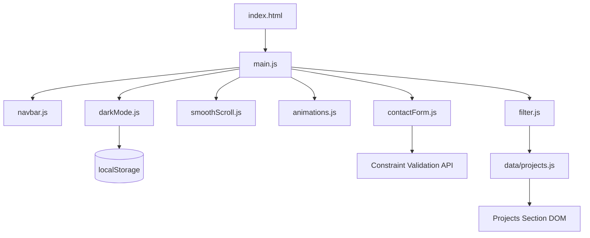

# Design Document — Portfolio Website

## Overview

Website portofolio pribadi ini adalah aplikasi web satu halaman (Single-Page Application) yang dibangun dengan HTML5, Tailwind CSS, dan Vanilla JavaScript murni tanpa framework. Tujuannya adalah menyajikan identitas profesional pemilik portofolio kepada calon klien atau rekruter secara elegan, cepat, dan aksesibel.

### Keputusan Desain Utama

| Keputusan | Pilihan | Alasan |
|---|---|---|
| CSS Framework | Tailwind CSS v3 via CDN Play | Tidak memerlukan build step, cocok untuk proyek statis sederhana |
| Dark Mode Strategy | `class` strategy (`dark` class pada `<html>`) | Memberikan kontrol penuh via JavaScript; kompatibel dengan localStorage |
| Form Handling | HTML5 Constraint Validation API + custom JS | Native, zero-dependency, aksesibel |
| Animasi | CSS transitions + Intersection Observer API | Performa tinggi, tidak memblokir main thread |
| Scroll Behavior | CSS `scroll-behavior: smooth` + JS fallback | Dukungan luas, tidak memerlukan library |

---

## Architecture

Website ini menggunakan arsitektur **Single-Page Static Website** dengan pemisahan tanggung jawab yang jelas:

```
portfolio-website/
├── index.html          # Struktur HTML utama (semua section)
├── css/
│   └── style.css       # Custom CSS (animasi, variabel, override Tailwind)
├── js/
│   ├── main.js         # Entry point — inisialisasi semua modul
│   ├── navbar.js       # Logika navbar: sticky, hamburger, active link
│   ├── darkMode.js     # Logika dark mode toggle + localStorage
│   ├── smoothScroll.js # Smooth scroll ke section
│   ├── animations.js   # Intersection Observer untuk animasi masuk
│   ├── filter.js       # Filter proyek berdasarkan teknologi/kategori
│   └── contactForm.js  # Validasi dan handling formulir kontak
├── assets/
│   ├── images/         # Foto profil, gambar proyek
│   └── cv.pdf          # File CV untuk diunduh
└── data/
    └── projects.js     # Data proyek (array of objects)
```

### Alur Data



---

## Components and Interfaces

### 1. Navbar Component (`navbar.js`)

Bertanggung jawab atas navigasi sticky, hamburger menu, dan highlight tautan aktif saat scroll.

```javascript
// Interface
initNavbar(): void
  // - Menambahkan event listener scroll untuk sticky behavior
  // - Menambahkan event listener klik hamburger
  // - Menggunakan IntersectionObserver untuk highlight active link

toggleMobileMenu(): void
  // - Menampilkan/menyembunyikan menu mobile
  // - Mengubah ikon hamburger ↔ close

updateActiveLink(sectionId: string): void
  // - Menghapus class 'active' dari semua tautan
  // - Menambahkan class 'active' ke tautan yang sesuai
```

**State:**
- `isMenuOpen: boolean` — status menu mobile

---

### 2. Dark Mode Component (`darkMode.js`)

Mengelola tema terang/gelap dengan persistensi localStorage dan deteksi preferensi sistem.

```javascript
// Interface
initDarkMode(): void
  // - Membaca preferensi dari localStorage
  // - Jika tidak ada, membaca prefers-color-scheme
  // - Menerapkan class 'dark' pada <html> jika diperlukan

toggleDarkMode(): void
  // - Mengubah class 'dark' pada <html>
  // - Menyimpan preferensi ke localStorage

getThemePreference(): 'dark' | 'light'
  // - Mengembalikan preferensi saat ini
```

**Strategi Tailwind Dark Mode:**
Tailwind dikonfigurasi dengan `darkMode: 'class'`. Ketika class `dark` ada pada elemen `<html>`, semua utility `dark:*` aktif. Contoh:
```html
<body class="bg-white dark:bg-gray-900 text-gray-900 dark:text-gray-100">
```

---

### 3. Contact Form Component (`contactForm.js`)

Mengelola validasi formulir kontak menggunakan HTML5 Constraint Validation API dengan pesan error kustom.

```javascript
// Interface
initContactForm(): void
  // - Menambahkan event listener 'submit' pada form
  // - Menambahkan event listener 'input' untuk real-time validation feedback

validateField(field: HTMLInputElement | HTMLTextAreaElement): boolean
  // - Memanggil field.checkValidity()
  // - Menampilkan atau menyembunyikan pesan error

showError(field: HTMLElement, message: string): void
  // - Menampilkan pesan error di bawah field

clearError(field: HTMLElement): void
  // - Menyembunyikan pesan error

handleSubmit(event: SubmitEvent): void
  // - Mencegah default submission
  // - Memvalidasi semua field
  // - Menampilkan feedback sukses atau error
```

**Validasi Rules:**
| Field | Rules |
|---|---|
| Nama | `required`, `minlength="2"` |
| Email | `required`, `type="email"` |
| Pesan | `required`, `minlength="10"` |

---

### 4. Project Filter Component (`filter.js`)

Memfilter tampilan Project Card berdasarkan teknologi atau kategori.

```javascript
// Interface
initFilter(projects: Project[]): void
  // - Mengekstrak semua tag unik dari data proyek
  // - Merender tombol filter
  // - Menambahkan event listener pada setiap tombol

filterProjects(tag: string): void
  // - Jika tag === 'all', tampilkan semua kartu
  // - Jika tidak, sembunyikan kartu yang tidak memiliki tag tersebut

renderProjects(projects: Project[]): void
  // - Merender Project Card ke DOM
```

---

### 5. Animations Component (`animations.js`)

Menggunakan Intersection Observer API untuk memicu animasi fade-in saat elemen masuk viewport.

```javascript
// Interface
initAnimations(): void
  // - Membuat IntersectionObserver dengan threshold 0.1
  // - Mengobservasi semua elemen dengan class 'animate-on-scroll'

observeElement(element: HTMLElement): void
  // - Menambahkan elemen ke observer
```

---

## Data Models

### Project

```javascript
/**
 * @typedef {Object} Project
 * @property {string} id          - Identifier unik proyek
 * @property {string} title       - Judul proyek
 * @property {string} description - Deskripsi singkat proyek
 * @property {string[]} tags      - Daftar teknologi/kategori (contoh: ['React', 'Node.js'])
 * @property {string} repoUrl     - URL repositori kode (GitHub, dll.)
 * @property {string|null} demoUrl - URL demo langsung, null jika tidak tersedia
 * @property {string} imageUrl    - URL gambar thumbnail proyek
 */

// Contoh data
const projects = [
  {
    id: "project-1",
    title: "E-Commerce Dashboard",
    description: "Dashboard analitik untuk platform e-commerce dengan visualisasi data real-time.",
    tags: ["JavaScript", "Chart.js", "REST API"],
    repoUrl: "https://github.com/username/ecommerce-dashboard",
    demoUrl: "https://demo.example.com/ecommerce",
    imageUrl: "assets/images/project-1.jpg"
  }
];
```

### ContactFormData

```javascript
/**
 * @typedef {Object} ContactFormData
 * @property {string} name    - Nama pengirim (min 2 karakter)
 * @property {string} email   - Alamat email pengirim (format valid)
 * @property {string} message - Isi pesan (min 10 karakter)
 */
```

### ThemePreference

```javascript
/**
 * @typedef {'dark' | 'light'} ThemePreference
 * Disimpan di localStorage dengan key 'portfolio-theme'
 */
```

### NavLink

```javascript
/**
 * @typedef {Object} NavLink
 * @property {string} label     - Teks tautan (contoh: "About")
 * @property {string} targetId  - ID section yang dituju (contoh: "about")
 */

const navLinks = [
  { label: "Home",     targetId: "hero" },
  { label: "About",    targetId: "about" },
  { label: "Skills",   targetId: "skills" },
  { label: "Projects", targetId: "projects" },
  { label: "Contact",  targetId: "contact" }
];
```

---

## Correctness Properties

*A property is a characteristic or behavior that should hold true across all valid executions of a system — essentially, a formal statement about what the system should do. Properties serve as the bridge between human-readable specifications and machine-verifiable correctness guarantees.*

### Property 1: Dark Mode Toggle adalah Idempoten Ganda (Round-Trip)

*For any* halaman yang dimuat dengan preferensi tema tertentu, mengklik Dark_Mode_Toggle dua kali berturut-turut harus mengembalikan tema ke kondisi semula.

**Validates: Requirements 7.2**

---

### Property 2: Persistensi Tema di localStorage

*For any* preferensi tema yang dipilih pengguna (terang atau gelap), setelah halaman dimuat ulang, tema yang diterapkan harus sama dengan preferensi yang tersimpan di localStorage.

**Validates: Requirements 7.3**

---

### Property 3: Validasi Form Menolak Input Kosong

*For any* kombinasi field formulir kontak di mana setidaknya satu field wajib kosong atau hanya berisi whitespace, pengiriman formulir harus dicegah dan pesan error harus ditampilkan.

**Validates: Requirements 6.2, 6.4**

---

### Property 4: Validasi Email Menolak Format Tidak Valid

*For any* string yang tidak memenuhi format email standar (RFC 5322 sederhana: mengandung `@` dan domain), field email harus menampilkan pesan error dan formulir tidak boleh terkirim.

**Validates: Requirements 6.3**

---

### Property 5: Filter Proyek Hanya Menampilkan Proyek yang Relevan

*For any* tag filter yang dipilih, semua Project Card yang ditampilkan harus memiliki tag tersebut dalam daftar `tags`-nya, dan semua Project Card yang tidak memiliki tag tersebut harus tersembunyi.

**Validates: Requirements 5.6**

---

### Property 6: Render Project Card Memuat Semua Informasi Wajib

*For any* objek Project yang valid, Project Card yang dirender ke DOM harus mengandung judul, deskripsi, daftar teknologi, dan tautan repositori.

**Validates: Requirements 5.2, 5.3**

---

## Error Handling

### Form Validation Errors

Kesalahan validasi formulir ditangani secara inline — pesan error muncul langsung di bawah field yang bermasalah, bukan sebagai alert atau toast global.

```
[Field Input]
[Pesan error merah di bawah field]
```

**Strategi:**
- Validasi dipicu saat `submit` (bukan saat mengetik, untuk menghindari gangguan UX)
- Setelah submit pertama gagal, validasi real-time aktif pada event `input` untuk feedback segera
- Pesan error menggunakan `aria-live="polite"` agar terbaca oleh screen reader

### Asset Loading Errors

- Gambar yang gagal dimuat akan menampilkan placeholder via event `onerror`
- CV yang tidak tersedia akan menampilkan notifikasi kecil alih-alih link rusak

### JavaScript Errors

- Setiap modul dibungkus dalam `try-catch` untuk mencegah satu error merusak seluruh halaman
- Error dicatat ke `console.error` untuk debugging

---

## Testing Strategy

### Pendekatan Pengujian

Website ini menggunakan **dual testing approach**:

1. **Unit Tests** — Menguji fungsi-fungsi JavaScript secara terisolasi (validasi form, filter proyek, dark mode logic)
2. **Property-Based Tests** — Menguji properti universal yang harus berlaku untuk semua input valid

### Library yang Digunakan

- **Test Runner**: [Vitest](https://vitest.dev/) — ringan, kompatibel dengan ESM, zero-config
- **Property-Based Testing**: [fast-check](https://fast-check.io/) — library PBT untuk JavaScript/TypeScript
- **DOM Testing**: [jsdom](https://github.com/jsdom/jsdom) (via Vitest environment)

### Unit Tests

Unit test difokuskan pada:

| Modul | Skenario yang Diuji |
|---|---|
| `darkMode.js` | Inisialisasi dari localStorage, inisialisasi dari `prefers-color-scheme`, toggle mengubah class `dark` |
| `contactForm.js` | Field valid lolos validasi, field kosong gagal, email tidak valid gagal, semua field valid → form terkirim |
| `filter.js` | Filter 'all' menampilkan semua proyek, filter spesifik menyembunyikan proyek yang tidak relevan |
| `navbar.js` | Toggle hamburger mengubah state, active link diperbarui saat section berubah |

### Property-Based Tests

Setiap property-based test dikonfigurasi untuk berjalan minimal **100 iterasi** dan diberi tag referensi ke properti desain.

#### Property 1: Dark Mode Toggle Round-Trip
```javascript
// Feature: portfolio-website, Property 1: Dark mode toggle adalah idempoten ganda
// fast-check: fc.property(fc.constantFrom('dark', 'light'), (initialTheme) => {
//   setTheme(initialTheme);
//   toggleDarkMode();
//   toggleDarkMode();
//   return getTheme() === initialTheme;
// })
```

#### Property 2: Persistensi Tema
```javascript
// Feature: portfolio-website, Property 2: Persistensi tema di localStorage
// fast-check: fc.property(fc.constantFrom('dark', 'light'), (theme) => {
//   setTheme(theme);
//   simulatePageReload();
//   return getAppliedTheme() === theme;
// })
```

#### Property 3: Validasi Form Menolak Input Kosong
```javascript
// Feature: portfolio-website, Property 3: Validasi form menolak input kosong
// fast-check: fc.property(
//   fc.record({ name: fc.string(), email: fc.string(), message: fc.string() }),
//   (formData) => {
//     const hasEmpty = Object.values(formData).some(v => v.trim() === '');
//     const result = validateForm(formData);
//     return hasEmpty ? result.isValid === false : true;
//   }
// )
```

#### Property 4: Validasi Email
```javascript
// Feature: portfolio-website, Property 4: Validasi email menolak format tidak valid
// fast-check: fc.property(fc.string().filter(s => !s.includes('@')), (invalidEmail) => {
//   return validateEmail(invalidEmail) === false;
// })
```

#### Property 5: Filter Proyek
```javascript
// Feature: portfolio-website, Property 5: Filter proyek hanya menampilkan proyek relevan
// fast-check: fc.property(fc.array(projectArbitrary), fc.string(), (projects, tag) => {
//   const filtered = filterProjects(projects, tag);
//   return filtered.every(p => p.tags.includes(tag));
// })
```

#### Property 6: Render Project Card
```javascript
// Feature: portfolio-website, Property 6: Render project card memuat semua informasi wajib
// fast-check: fc.property(projectArbitrary, (project) => {
//   const html = renderProjectCard(project);
//   return html.includes(project.title) &&
//          html.includes(project.description) &&
//          html.includes(project.repoUrl) &&
//          project.tags.every(tag => html.includes(tag));
// })
```

### Integration Tests

Pengujian integrasi menggunakan browser automation (Playwright) untuk memverifikasi:

- Smooth scroll berfungsi saat tautan navigasi diklik
- Hamburger menu muncul dan berfungsi di viewport mobile (375px)
- Dark mode toggle mengubah tampilan visual secara keseluruhan
- Formulir kontak menampilkan error yang benar saat disubmit dengan data tidak valid
- Unduhan CV terpicu saat tautan diklik

### Aksesibilitas

- Semua elemen interaktif memiliki `aria-label` atau teks yang deskriptif
- Pesan error form menggunakan `aria-live="polite"` dan `aria-describedby`
- Kontras warna diverifikasi menggunakan [axe-core](https://github.com/dequelabs/axe-core)
- Navigasi keyboard diuji secara manual
